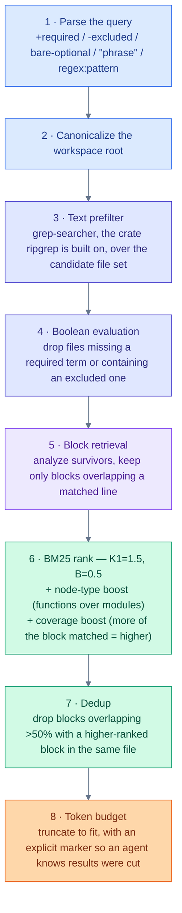
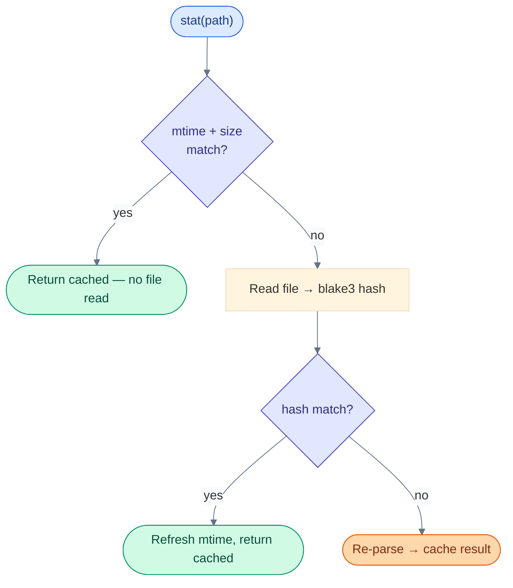

# Architecture

This is the design in prose. For verbatim code, see [`docs/spec/`](docs/spec/README.md).

## Two levels: analyze once, aggregate separately

Every file gets parsed exactly once, by a `LanguageAnalyzer`:

```
file → LanguageAnalyzer::analyze() → FileAnalysis (owned: symbols, deps, exports, code blocks)
```

`FileAnalysis` never borrows from the parser's arena — everything in it is owned data (`String`, not `&str`; `Vec<T>` of owned items). The arena drops at the end of `analyze()`. This is a hard rule, not a style preference: it's what lets `FileAnalysis` be cached, shared across threads via `Arc`, and outlive the parse call that produced it.

A second layer, `WorkspaceEnricher`, folds per-file analyses into workspace-wide structure — an import graph, a symbol index — without re-parsing anything:

```
Vec<FileAnalysis> → WorkspaceEnricher::update() × N files → WorkspaceIndex
```

Two enrichers exist today: `ImportGraphEnricher` (which files import which) and `SymbolIndexEnricher` (symbol name → declaration sites). Both are cheap bookkeeping over already-parsed data — the expensive part is parsing, done once, upstream.

Building a `WorkspaceIndex` is three phases:

1. **Parallel analyze.** Walk the directory, run `LanguageAnalyzer::analyze()` per file via `rayon`, then sort by path. Sorting happens _after_ parallel completion rather than enforcing commit order _during_ it — import resolution is real (`oxc_resolver`, not name-matching), so there's no insertion-order ambiguity to guard against.
2. **Stream `update()`** for every (file, enricher) pair.
3. **`finalize()`** each enricher — by now the full file index exists, so an enricher can resolve `Utf8PathBuf → FileIdx` for edges it deferred during `update()`.

## The search pipeline

`search` is eight stages, each one doing strictly less work on strictly fewer candidates than the last:



Every stage fails toward "fewer, better results" rather than "more results, sort it out downstream" — the token budget in stage 8 is a last resort, not the primary filter.

## Caching: two tiers, one invariant



`ContentHash` (blake3) is authoritative; mtime/size is the cheap dirty-bit that avoids reading files that haven't actually changed. Two storage layers:

| Layer | Scope | Invalidation |
| --- | --- | --- |
| In-memory `DashMap` | Process-local, lock-free reads — repeat calls within one run | Dropped with the process |
| Disk-persisted `.monokl/cache.json` | Repeat calls across separate CLI invocations | Version- and config-hash-gated, so a monokl upgrade or a tsconfig change invalidates it automatically |

There's deliberately no persistent on-disk _search_ index (no tantivy-style inverted index, no SQLite). The cache remembers _parses_; the `WorkspaceIndex` (import graph, symbol index) is rebuilt in memory on every invocation from the cached per-file data — cheap, because it's aggregation over already-parsed structure, not re-parsing. See [`docs/spec/05-research-and-decisions.md`](docs/spec/05-research-and-decisions.md) for the reasoning behind that tradeoff. The threshold where it stops holding (roughly: past ~50k files, a persistent session becomes worth its complexity) is a hypothesis, not a measurement — nothing external corroborates it, and the benchmark in [`docs/spec/08-library-session-api.md`](docs/spec/08-library-session-api.md#13-benchmarks) is what decides it.

## Library API

Embedders (Wisp) don't call the free functions. They open a `Workspace` once, take `Snapshot`s from it, and run queries — singly or as one `query(&[Op])` batch — against a snapshot. A change enters as one transactional `apply_change(Change)`; the index is immutable after build, so the host swaps a new `Arc` in and old snapshots simply go stale, no cancellation needed. Every result carries a `Provenance` a consumer can cache and later revalidate with one call. Full design, identity grammar, and the crate split in [`docs/spec/08-library-session-api.md`](docs/spec/08-library-session-api.md).

## Multi-language: capability, not uniformity

Not every language gets the same precision, and the design says so explicitly instead of pretending otherwise. Every analyzer reports a `CapabilityPrecision` per operation:

```
Unsupported < Heuristic < Structural < Exact
```

| Level | Means | Example |
| --- | --- | --- |
| **Exact** | Real resolution | TS/JS import resolution via `oxc_resolver` |
| **Structural** | Real AST parsing, heuristic resolution | Rust's module-path walker; Go's `go.mod`-based cross-package resolution |
| **Heuristic** | Regex/text-scan level | A language with no real parser yet |
| **Unsupported** | The operation doesn't exist for this language | — |

When an operation asks for more precision than an analyzer can give, the response carries a `Skipped` or `Warning` diagnostic instead of silently returning wrong answers or crashing. An `AnalyzerRegistry` dispatches each file to the first analyzer that claims it — TS/JS and Rust are registered with full native parsers; Python, Go, and Java are specified at `Structural` target precision but not yet implemented (see [README.md](README.md) for current status).

## What's explicitly out of scope

Full list and rationale in [PRINCIPLES.md](PRINCIPLES.md#non-goals). Briefly:

- No persistent search index.
- No full [Salsa](https://github.com/salsa-rs/salsa) incremental framework — yet. Tracked as an open investigation, not ruled out.
- No embedding-based retrieval by default.
- No stemming.
- No in-memory trigram index — measured at 600MB–1.2GB at scale in an earlier design, rejected for cause.
- No cancellation. The index is immutable after build, so a change swaps a pointer and stale snapshots are detectable rather than interrupted — see [`docs/spec/08-library-session-api.md`](docs/spec/08-library-session-api.md#3-no-cancellation).
