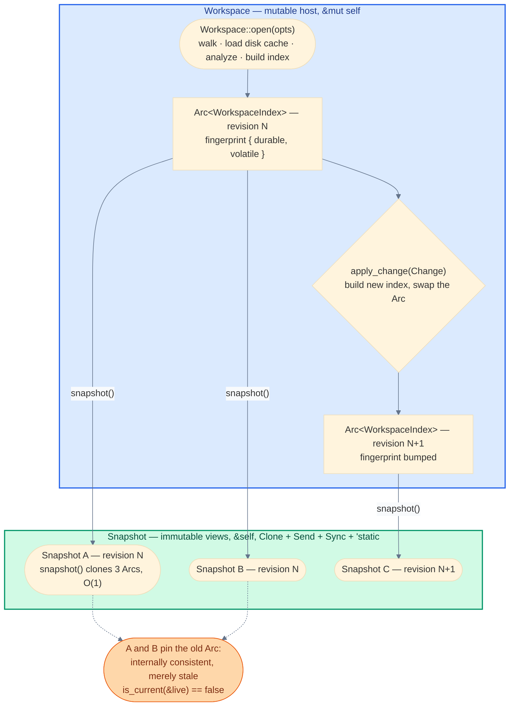
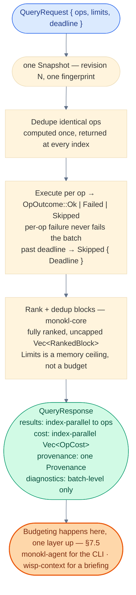
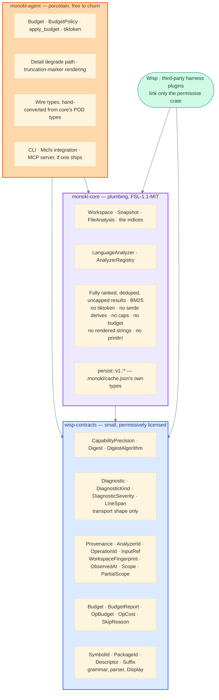

# Part 8: Library session API, batch queries, and identity

> Design for monokl as an embedded library. Not yet implemented. Written because Wisp (the project-intelligence layer that will embed monokl in-process) needs one workspace open, N queries against one consistent view, stable identities it can cache pointers to, and a way to ask "is this pointer still valid" without rebuilding anything. Parts 1–4's free functions cannot give it that, and the gap is in the API shape, not the CLI. Research behind every decision here is in [05-research-and-decisions.md §15](./05-research-and-decisions.md).

Part of the [monokl spec](./README.md).

## 1. What's wrong with the free-function API

`pipeline::search`, `extract`, `symbols`, and `dependents` are free functions. Each constructs its own `TsAnalyzer::from_workspace_opts`, and `dependents` calls `WorkspaceIndex::build` — a full directory walk plus enricher fold — on every call. Embedding as a library doesn't fix that.

| Defect | Consequence |
| :--- | :--- |
| Every free function builds its own analyzer and index | Ten `dependents` calls in one process are ten walks and ten index builds. Only the per-file parse cache (the `DashMap`) is shared. |
| `WorkspaceIndex::build` is `pub(crate)` | A caller can't build once and hold. |
| `build` brackets itself with `persist::init`/`persist::flush` | A read-only caller pays a disk write it never asked for, N times. |
| `pipeline::symbols` hardcodes `per_file_cap = 50` / `total_cap = 500`; `pipeline::dependents` hardcodes `Cap = 200` | Presentation policy welded onto the library. The symbol caps truncate an *unordered* set — nothing distinguishes the 50 kept from the ones dropped. |
| Each emits its own pre-rendered English truncation string from inside the analysis layer | Rendering decided where analysis lives. |

This part replaces the free functions with a session object, moves presentation policy out of the library, and defines the identity and provenance types a consumer can cache against.

## 2. `Workspace` and `Snapshot`

Two types, not one. `Workspace` is the mutable host; `Snapshot` is an immutable, consistent view. The asymmetry is `&mut self` vs `&self`, and that is the whole concurrency design — checked at compile time, no locks, no retry wrapper.

### 2.1 Revision lifecycle



### 2.2 Types

```rust
use std::sync::Arc;
use std::time::Instant;
use camino::{Utf8Path, Utf8PathBuf};
use wisp_contracts::{CapabilityPrecision, Digest, Provenance, SymbolId};

/// Owns the mutable state: the analysis cache and the current index. `!Clone`.
///
/// `Send`, so a host can move it onto a dedicated owner thread. Deliberately **not** `Sync`: "two threads share one
/// `Workspace`" is then a compile error, which is the invariant the owner-thread arrangement in §2.4 rests on. Sharing
/// is what `Snapshot` is for. `Send` requires `AnalyzerRegistry` to hold `Box<dyn LanguageAnalyzer + Send>`.
pub struct Workspace {
    opts: WorkspaceOptions,
    cache: Arc<AnalysisCache>,
    index: Arc<WorkspaceIndex>,
    fingerprint: WorkspaceFingerprint,
    registry: AnalyzerRegistry,
}

impl Workspace {
    /// Walk, load the disk cache, analyze, build the index. Fallible I/O, hence `open` not `new`.
    pub fn open(opts: WorkspaceOptions) -> Result<Self>;

    /// O(1): clones three `Arc`s and copies the fingerprint. No lifetime tied to `&self`.
    pub fn snapshot(&self) -> Snapshot;

    /// Apply one transactional change set. Builds a new `Arc<WorkspaceIndex>` and swaps it in;
    /// outstanding snapshots keep the old one and become stale (see §3).
    pub fn apply_change(&mut self, change: Change) -> Result<ChangeSummary>;

    /// Persist the parse cache to `.monokl/cache.json`. Idempotent and cheap when nothing is queued.
    /// `&self` because the cache has interior mutability; a snapshot-holding reader flushing is harmless.
    pub fn flush_cache(&self) -> Result<CacheStats>;

    pub fn fingerprint(&self) -> WorkspaceFingerprint;

    /// Named escape hatch, cf. rust-analyzer's `AnalysisHost::raw_database()`.
    #[cfg(feature = "raw-api")]
    pub fn analysis_cache(&self) -> &AnalysisCache;
}

impl Drop for Workspace {
    /// Best-effort flush, errors logged at `warn!`. Callers who need the error call `flush_cache` explicitly —
    /// this is the `std::io::BufWriter` contract, and for the same reason.
    fn drop(&mut self) { /* ... */ }
}

/// Immutable view of one revision. `Clone + Send + Sync + 'static` so it can be handed to a rayon worker or a tokio task.
/// Deliberately does **not** derive `Serialize` — see §9.
#[derive(Clone)]
pub struct Snapshot {
    index: Arc<WorkspaceIndex>,
    cache: Arc<AnalysisCache>,
    fingerprint: WorkspaceFingerprint,
    scope: Scope,
}

impl Snapshot {
    pub fn fingerprint(&self) -> WorkspaceFingerprint;
    pub fn scope(&self) -> &Scope;

    /// True iff this snapshot is the newest revision of its `Workspace`. One fingerprint comparison.
    pub fn is_current(&self, live: &Workspace) -> bool;

    /// True iff every input a prior result depended on is unchanged. See §8.
    pub fn provenance_is_current(&self, p: &Provenance) -> bool;

    // Queries — all `&self`, all execute against this one revision. §7 defines the batch form.
    pub fn search(&self, opts: &SearchOptions) -> Result<SearchResult>;
    pub fn symbols(&self, files: &[Utf8PathBuf], detail: Detail) -> Result<SymbolsResult>;
    pub fn definition(&self, symbol: &SymbolId) -> Result<DefinitionResult>;
    pub fn refs(&self, symbol: &SymbolId, detail: Detail) -> Result<RefsResult>;
    pub fn dependents(&self, file: &Utf8Path) -> Result<DependentsResult>;
    pub fn imports(&self, file: &Utf8Path) -> Result<ImportsResult>;
    pub fn extract(&self, req: &ExtractRequest) -> Result<Vec<CodeBlock>>;
    pub fn query(&self, req: &QueryRequest) -> QueryResponse;

    /// Uncapped, unbudgeted, no stability guarantee across minor versions. See §10.
    #[cfg(feature = "raw-api")]
    pub fn analysis(&self, path: &Utf8Path) -> Option<Arc<FileAnalysis>>;
    #[cfg(feature = "raw-api")]
    pub fn analyses(&self) -> impl Iterator<Item = (&Utf8Path, &Arc<FileAnalysis>)>;
}
```

`Workspace` gets thin forwarding methods for every query (`ws.search(o)` ≡ `ws.snapshot().search(o)`) so the single-query case isn't a two-step dance. The Part 1 free functions survive as one-shot wrappers:

```rust
pub fn search(opts: &SearchOptions) -> Result<SearchResult> {
    Workspace::open(WorkspaceOptions::from(opts))?.search(opts)
}
```

The CLI keeps using the wrappers. Wisp holds a `Workspace` for the life of a briefing.

### 2.3 `WorkspaceOptions`

```rust
pub struct WorkspaceOptions {
    pub root: Utf8PathBuf,
    pub tsconfig: TsconfigMode,
    pub lifetime: Lifetime,
    pub scope: Scope,
}

/// Astral's `ty` is a one-shot CLI that still builds a session database and then calls `disable_lru` + `freeze`
/// because it knows nothing will change. Same idea: `OneShot` skips every bookkeeping structure that exists only to
/// make `apply_change` cheap.
#[derive(Clone, Copy, Debug, Default, PartialEq, Eq)]
pub enum Lifetime {
    #[default]
    OneShot,
    Session,
}
```

`Scope` is defined in §5.

### 2.4 How an embedder holds a `Workspace`

Monokl does not ship a service, but the `&mut self` / `&self` asymmetry only pays off if the embedder holds the two types the way the split intends. Wisp's arrangement is recorded here because it is the arrangement `Send + !Sync` was chosen for, and because the stale-snapshot memory bound in §3.2 is a consequence of it.

| Element | Shape | Why |
| :--- | :--- | :--- |
| Ownership | One actor thread owns the `Workspace` by value and is the only caller of `apply_change`, `open`, and `flush_cache` | `&mut self` is free when the actor owns the value. `Mutex<Workspace>` makes every reader queue behind a 1.5–4 s open or a 100 ms–1 s `apply_change` merely to call `snapshot()`; `RwLock<Workspace>` still holds the write lock for the whole rebuild and cannot express "keep serving the previous revision while the next one builds". |
| Read path | The current `Snapshot` is published beside the actor in an `RwLock<Arc<Snapshot>>`; a reader takes the lock for exactly one `Arc` clone | Readers never touch the `Workspace` and never queue behind an in-flight change. The write lock is held for one pointer store, never for the rebuild. |
| Lease | Each request holds a `!Clone` `SnapshotLease` that derefs to `Snapshot` and releases on drop | A request cannot fan one revision out across its own subtasks or store it past its own lifetime, which is what makes the bound below hold with no bookkeeping. |
| Query execution | A fixed pool of `min(available_parallelism(), 4)` threads, bridged to any async transport by a channel out and a oneshot back | rust-analyzer, `ty`, and `ruff` all run analysis on a hand-rolled fixed-size pool with no async runtime underneath; `ty` and `ruff` use this exact expression. |

**Not `tokio::task::spawn_blocking`**, for four reasons from tokio's own documentation: the blocking pool defaults to 512 threads and is sized for I/O rather than CPU work; its queue applies no backpressure and can grow unbounded; a blocking task cannot be aborted, so runtime shutdown waits for an in-flight cold open to finish; and 512 concurrent queries pin 512 revisions (§3.2). Monokl runs `rayon::par_iter` inside `Workspace::open`, and from a non-rayon thread rayon injects the job and parks the caller on a latch contributing no work — so each concurrent call costs one pool thread parked plus the rayon pool's own threads. The rule that follows: rayon is entered only from a pool thread or the actor thread, never from an async worker, and nothing inside a rayon job blocks on a runtime handle.

## 3. No cancellation

rust-analyzer cancels in-flight queries when a change arrives because Salsa's memo table is mutable storage shared by every outstanding snapshot — a write has to wait for readers to die, so it panics them with a sentinel and catches it at the `ide` boundary. `ty` inherits the same mechanic (`Arc::get_mut` on the database "because `trigger_cancellation` drops all other DB references").

Monokl's `WorkspaceIndex` is never mutated after construction. `apply_change` builds a new `Arc<WorkspaceIndex>` and swaps the pointer. Old snapshots stay internally consistent; they are merely stale, and `Snapshot::is_current` says so in one comparison. Nothing needs to be interrupted.

### 3.1 What this removes

- `Cancellable<T>` from every signature.
- `catch_unwind` from the API boundary.
- `UnwindSafe`/`RefUnwindSafe` bounds from every type.
- The requirement that the host process build with `panic = "unwind"`.

Revisit only if a `PrecisionUpgrader` ([06 §2](./06-daemon-architecture.md)) ever holds a shared mutable backend — and even then, scope cancellation to that upgrader's own `Result`, not the query API.

### 3.2 What it costs

The one thing cancellation *did* buy that batching reintroduces is head-of-line protection: one pathological op in a batch stalls the whole response. `QueryRequest::deadline` (§7) is the in-process substitute — unfinished ops are marked `Skipped { Deadline }`, the rest return.

The second cost is unbounded stale-snapshot memory: a caller holding an old snapshot pins its `Arc<WorkspaceIndex>` (estimated 90–140MB at 50k files). rust-analyzer bounds this with Salsa's LRU; `ty` sidesteps it by disabling the LRU in `OneShot`. Monokl has no bound. §13's benchmark holds two snapshots across a change and measures RSS so this is a known number, not a surprise.

**The bound is the embedder's, and it falls out of the query-pool size in §2.4.** Live revisions never exceed `1 + pool_size`: the current one, plus one per in-flight request holding a lease. Monokl supplies the per-index number; the embedder supplies the multiplier.

| Concurrency bound | Live revisions | Resident at 5k files (~9–14 MB each) | Resident at 50k files (90–140 MB each) |
| :--- | :--- | :--- | :--- |
| Fixed query pool of 4 (Wisp's) | 5 | 45–70 MB | 450–700 MB |
| A 512-thread blocking pool | 513 | 4.6–7.2 GB | 46–72 GB |

The 5k-file column interpolates linearly from the 50k estimate and is unmeasured; §13's stale-snapshot benchmark is what replaces both columns with real numbers. The pool cap is a memory bound first and a throughput choice second.

## 4. `Change`: how a revision enters

A path list is the wrong payload. rust-analyzer's `FileChange` carries `Vec<(FileId, Option<String>)>` — content, not just a dirty flag — and Monokl needs the same the moment Wisp or an editor holds an unsaved buffer. And rust-analyzer's VFS content-hash-gates at the event source: a set whose hash equals the current one records no change at all, so a `touch` or a save-with-no-edit doesn't cascade.

```rust
pub struct Change {
    files: Vec<(Utf8PathBuf, FileContent)>,
    /// Config changes land atomically with file changes, the way rust-analyzer bundles `crate_graph` into `FileChange`.
    opts: Option<WorkspaceOptions>,
}

pub enum FileContent {
    /// Re-stat and re-read from disk. The default for a git-delta-driven caller who knows paths but not bytes.
    Reread,
    /// Caller already has the bytes (editor buffer, Wisp reading a small artifact). Skip the disk.
    Text(String),
    Deleted,
}

impl Change {
    /// Proposal-5 ergonomics verbatim: `Change::touched(git_delta)`. All `FileContent::Reread`.
    pub fn touched<I: IntoIterator<Item = Utf8PathBuf>>(paths: I) -> Self;
    pub fn set_text(&mut self, path: Utf8PathBuf, text: String) -> &mut Self;
    pub fn deleted(&mut self, path: Utf8PathBuf) -> &mut Self;
    pub fn with_opts(&mut self, opts: WorkspaceOptions) -> &mut Self;
}

pub struct ChangeSummary {
    pub reanalyzed: Vec<Utf8PathBuf>,
    pub cache_hits: Vec<Utf8PathBuf>,
    pub created: usize,
    pub deleted: usize,
    pub structure_changed: bool,
    pub fingerprint: WorkspaceFingerprint,
}
```

One `apply_change` is one transaction: one fingerprint bump, one enricher re-fold, not N. `invalidate(paths)` may exist as a documented alias for `apply_change(Change::touched(paths))`; it is not the primitive.

`structure_changed` matters because creates and deletes are categorically more expensive than modifies today — see §4.1. Mirror rust-analyzer's `has_structure_changes`: a `Change` of pure modifications re-analyzes the touched files and patches the enrichers; any create or delete triggers a full index rebuild until the prerequisite below lands.

`Workspace::open` still re-stats everything. The four-tier lookup in [01 §16](./01-core-architecture.md) (`stat` → mtime/size → blake3 → parse) is Bazel's file-digest cache shape and needs no help. `apply_change` is the optimization for a long-lived `Workspace` whose caller has better information than a stat loop, not a replacement for it.

### 4.1 Prerequisite: `FileIdx` stops being observable

`WorkspaceIndex::build` sorts analyses by path and assigns `FileIdx(i as u32)` by enumeration position. `ImportGraph.reverse` and `SymbolIndex` both key on it. Two consequences neither the scoped open (§5) nor `apply_change` can live with:

- Any create or delete renumbers every `FileIdx` after it, invalidating both enrichers wholesale. A pure content modification doesn't. Monokl has no guard distinguishing the two.
- The same path gets a different `FileIdx` in a scoped open and a full open, so nothing keyed on `FileIdx` is comparable across them.

Fix: key `ImportGraph` and `SymbolIndex` on a stable interned path id (`FileId(u32)` assigned by an interner that survives across builds within one `Workspace`, and by path order within one build). `FileIdx` stays as a dense array offset used only inside a single `WorkspaceIndex` and is never returned, serialized, or compared across builds. This is not new work relative to Part 1's design intent — `FileIdx` was already deliberately non-`Serialize` — it just needs the enrichers to stop treating it as identity.

## 5. Scope: a completeness axis, orthogonal to precision

Wisp usually knows its seed set (a plan's declared files plus the git delta) and wants full analysis of ~50 files, not 50k. But "same `Workspace`, fewer files" produces silently wrong answers for one class of query, so scope has to be a first-class, visible property of every result.

### 5.1 The type

```rust
/// Lives in `wisp-contracts`. Serializes internally tagged: `{ "kind": "complete" }` or
/// `{ "kind": "partial", "seeds": [...], "hops": 1, ... }`.
#[derive(Clone, Debug, PartialEq, Eq, Hash)]
#[non_exhaustive]
#[serde(tag = "kind", rename_all = "camelCase")]
pub enum Scope {
    Complete,
    Partial(PartialScope),
}

#[derive(Clone, Debug, Default, PartialEq, Eq, Hash)]
#[non_exhaustive]
#[serde(rename_all = "camelCase")]
pub struct PartialScope {
    pub seeds: Vec<Utf8PathBuf>,
    /// Import-closure depth from the seeds. Default 1.
    pub hops: u8,
    /// Fan-out cap per seed. Without it, one hub module blows the budget on hop 2.
    pub max_neighbors_per_seed: u16,
    pub max_total_nodes: u32,
    /// The exact file set that was analysed. Recorded so provenance can distinguish "stale full" from "fresh partial".
    /// Not derivable from `seeds` and `hops` after the fact, because the caps may have bitten.
    pub analysed: Vec<Utf8PathBuf>,
}
```

The payload is a struct rather than an inline variant because adding a field to an enum variant is a major change even on a `#[non_exhaustive]` enum, while adding one to a `#[non_exhaustive]` struct is minor. One level of JSON nesting buys independent versioning of a type four repositories deserialize.

Precision answers "how well was this resolved"; scope answers "over what file set". They are independent — Sourcegraph's search-based navigation is imprecise but whole-tree; a scoped open is precise but partial — and one enum can't carry both.

### 5.2 Which operations are sound under `Partial`

| Class | Operations | Behaviour under `Partial` |
| :--- | :--- | :--- |
| **Forward-closure** | `symbols`, `definition`, `explain`, `extract`, `search` | Sound, restricted to the analysed set. The closure must be materialised the way Kythe's `CompilationUnit` bundles every required input, not merely assumed present. |
| **Reverse-closure** | `dependents`, `refs` | Not sound — they need inbound edges, and a seed-rooted outbound walk cannot see a file outside the closure that references a seed. Returns `OpOutcome::Skipped { reason: SkipReason::Unsupported }` with a `Diagnostic` naming the whole-tree operation the caller needs — the way TypeScript makes Find-All-References a non-feature across project-reference boundaries rather than a lossy one. Never a silent under-approximation. |
| **Out-of-scope import** | any | An import that resolves to a path outside the scope is a diagnostic, not a missing edge. |

### 5.3 Why `hops` defaults to 1

Defaults are evidence-driven. RepoGraph's k-hop ablation on SWE-bench Lite:

| Configuration | Resolve rate | Nodes |
| :--- | :--- | :--- |
| No graph (baseline) | 27.33% | — |
| 1-hop, flattened | 29.67% | 11.6 |
| 2-hop, flattened | 26.00% — *worse than no graph* | 54.5 |
| 2-hop, summarized | 28.67% — still below 1-hop | 54.5 |

So `hops` defaults to 1, and `hops = 2` is permitted only with `max_neighbors_per_seed` set and `Detail::Lite` (§7) on the outer ring.

The observation from every system surveyed — RepoGraph, LocAgent, SuperCoder's structural index — is that none of them scope the *graph*; they build a cheap repo-wide graph once, then extract a local ego-graph. The design this spec should build toward: a parse-light repo-wide pass producing only import edges and def/ref names (enough for `dependents`/`refs` to be complete), with full `FileAnalysis` computed only over the closure. That makes `Partial` a detail-depth choice rather than a soundness hole. Until that lands, `Partial` disables the reverse-closure ops outright as above.

## 6. Lazy enrichers and durability tiers

"It's not the incrementality that makes an IDE fast. Rather, it's laziness — the ability to skip huge swaths of code altogether." (rust-analyzer, *Three Architectures for a Responsive IDE*.) Monokl currently eagerly runs both enrichers over the whole tree before answering anything. `symbols` needs neither the import graph nor the symbol index; `dependents` needs only the import graph.

```rust
impl WorkspaceIndex {
    /// Folded on first call, cached in a `OnceLock` inside the `Arc`. Snapshots share the fold.
    pub fn import_graph(&self) -> &ImportGraph;
    pub fn symbol_index(&self) -> &SymbolIndex;
    pub fn trait_impl_index(&self) -> &TraitImplIndex;
}
```

Durability is Salsa's cheapest idea and needs none of Salsa's machinery. rust-analyzer recovered ~300ms per keystroke by tagging inputs with a tier (library vs local) and keeping a version *vector* instead of one counter, so a local edit never revalidates stdlib-derived queries. Monokl has the same free partition:

```rust
/// Lives in `wisp-contracts`. Both fields serialize as 16-character lowercase hex strings, not JSON numbers: a `u64`
/// exceeds JavaScript's `Number.MAX_SAFE_INTEGER` and is silently rounded by every JSON parser in a Node consumer,
/// including michi's own NAPI surface. A rounded fingerprint never compares equal, so every freshness check
/// downstream reports a spurious miss.
#[derive(Clone, Copy, Debug, Default, PartialEq, Eq, Hash)]
#[non_exhaustive]
#[serde(rename_all = "camelCase")]
pub struct WorkspaceFingerprint {
    /// Config hash + resolved analyzer set + `node_modules`/`target`/vendored/outside-worktree content.
    #[serde(with = "hex_u64")]
    pub durable: u64,
    /// Tracked workspace files. Bumping `durable` also bumps `volatile`; not the reverse.
    #[serde(with = "hex_u64")]
    pub volatile: u64,
}
```

Which tier absorbs configuration is stated so neither side assumes the other carries it: `durable` covers workspace-level inputs — the root, the layout configuration, and the resolved analyzer set — while `AnalyzerId.config_hash` (§8.2) covers per-analyzer configuration such as `tsconfig.json`.

A `Change` touching only volatile inputs leaves `durable` alone, so any cached result derived only from durable inputs (an import edge into a vendored package, say) stays valid across an ordinary edit. This is the 90% of durability's benefit at 0% of Salsa's cost, and it makes the eventual Salsa migration ([05 §4](./05-research-and-decisions.md)) a narrowing rather than a rewrite.

## 7. Batch query

### 7.1 Why batch

The stated reason for a batch API — one shared token budget — is not a reason at all: core holds no budget (§7.5). The two that survive are the ones that mattered anyway:

1. **Intermediate results never enter the model's context.** Anthropic's code-execution-with-MCP write-up: "every intermediate result must pass through the model"; their worked example goes from 150,000 tokens to 2,000. Ten monokl ops in one call means nine payloads the agent never reads. This is what makes a Wisp briefing cheaper than three tool calls.
2. **Snapshot atomicity.** Ten separate calls against a long-lived `Workspace` can straddle an `apply_change` and return a briefing whose sections disagree. One batch runs against one `Snapshot`, so all N results share one revision and one `Provenance`.

Neither LSP (Base Protocol 0.9: "It currently does not support JSON-RPC batch messages") nor MCP (one `tools/call` per request; pagination only on list operations) can batch at the protocol level, so batching can only live *inside* one call. That is a structural argument for this API, not a stylistic one.

### 7.2 Flow



### 7.3 Request

```rust
pub struct QueryRequest<'a> {
    pub ops: &'a [Op],
    /// A work ceiling, not a presentation policy. It exists to bound the memory one batch can materialise, in units
    /// core already tracks. Every op reports `items_total`, so a caller always sees what the ceiling cut. Core applies
    /// no other limit and owns no budget — see §7.5.
    pub limits: Limits,
    /// In-process substitute for cancellation (§3). Unfinished ops are `Skipped { Deadline }`.
    pub deadline: Option<Instant>,
}

pub enum Op {
    Symbols    { files: Vec<Utf8PathBuf>, detail: Detail },
    Definition { symbol: SymbolId },
    Refs       { symbol: SymbolId, detail: Detail },
    Dependents { file: Utf8PathBuf },
    Imports    { file: Utf8PathBuf },
    Search     { query: String, filter: SearchFilter },
    Extract    { file: Utf8PathBuf, span: Option<LineSpan> },
}

/// Degrade before drop. LSP 3.17's `workspaceSymbol/resolve` returns symbols without ranges and resolves lazily;
/// monokl's existing `symbols --lite` is the same lever. Twenty lite symbols beat five full ones in a briefing.
#[derive(Clone, Copy, Debug, Default, PartialEq, Eq)]
pub enum Detail { Lite, #[default] Full }

#[derive(Clone, Copy, Debug, PartialEq, Eq, Hash)]
pub struct Limits {
    pub max_items_per_op: u32,
    pub max_bytes_per_op: u64,
}

impl Default for Limits {
    /// 100,000 items / 64 MiB per op. Generous by construction: a ceiling a caller hits routinely is a cap, and caps
    /// are what §9.1 deletes. Both numbers are guesses until §13's incremental benchmark reports the real volume of an
    /// uncapped batch.
    fn default() -> Self { Self { max_items_per_op: 100_000, max_bytes_per_op: 64 << 20 } }
}
```

`Detail` stays on the `Op` because `Lite` is cheaper to *compute* — the `workspaceSymbol/resolve` precedent is about analysis depth, not about cutting a rendered result. That makes degrade-before-drop a caller-side lever with no re-query, under one acceptance criterion core must assert rather than imply:

> **`lite(full(x)) == lite_direct(x)`** for every op supporting `Detail`. `Lite` is a projection of `Full`, not a separate computation, so a caller holding a `Full` result produces the `Lite` result byte-identically without another query. Without this, caller-side degrade either costs a round trip or silently differs from what `Detail::Lite` would have returned.

### 7.4 Response

```rust
pub struct QueryResponse {
    /// INVARIANT: `results.len() == ops.len()` and `results[i]` answers `ops[i]`, including failed and skipped ops.
    /// This is DataLoader's ordering contract. Identical ops within a batch are computed once and returned at every index.
    pub results: Vec<OpOutcome>,
    /// INVARIANT: `cost.len() == ops.len()`. What each op actually produced, in units core computes for free.
    /// Not a budget decision — no limit was applied except `Limits`.
    pub cost: Vec<OpCost>,
    /// One fingerprint for the batch: it ran against a single snapshot. `provenance_is_current` is one check for N results.
    pub provenance: Provenance,
    /// Batch-level only (e.g. missing tsconfig). Per-op diagnostics live in the outcome.
    pub diagnostics: Vec<Diagnostic>,
}

pub enum OpOutcome {
    Ok(OpResult),
    /// Per-op failure never fails the batch.
    Failed  { error: MonoklError },
    Skipped { reason: SkipReason },
}

/// Lives in `wisp-contracts`. Core never exhausts a budget, so there is no `BudgetExhausted`: an op a caller drops
/// during its own budgeting never reaches an `OpOutcome` at all.
pub enum SkipReason { Unsupported, Deadline, NotIndexed }

pub enum OpResult {
    Symbols(SymbolsResult), Definition(DefinitionResult), Refs(RefsResult),
    Dependents(DependentsResult), Imports(ImportsResult),
    Search(SearchResult), Extract(Vec<CodeBlock>),
}

/// Lives in `wisp-contracts`. What one op produced, in units core computes for free. Not an accounting of a budget:
/// the only limit core applied is `Limits`.
pub struct OpCost {
    pub bytes: u64,
    pub items_returned: u64,
    /// Pre-ceiling count. `items_total > items_returned` is the only "there is more" signal — no marker string, ever.
    pub items_total: u64,
    /// Wall-clock milliseconds. An integer, not a `Duration`, for the same reason `observed_at` is not a `SystemTime` (§11).
    pub elapsed_ms: u64,
    /// This op's precision. Not reduced to a batch-level value.
    pub precision: CapabilityPrecision,
    /// The `Limits` ceiling, not a budget, cut this op.
    pub ceiling_hit: bool,
}
```

Every result type carries its own `precision` and `scope` — a batch spanning an `Exact` TypeScript `refs` and a `Structural` Rust `dependents` has no single honest precision, so there is no batch-level one.

### 7.5 Where the budget went

`Budget`, `BudgetPolicy`, `apply_budget`, and tiktoken are **not** in `monokl-core`. Core returns fully ranked, uncapped results plus per-op cost; every budget is allocated one layer up, by `monokl-agent` for the CLI and by Wisp's `wisp-context` for a briefing. Wisp depends on `monokl-core` alone and never links `monokl-agent`, so monokl's CLI, wire types, allocation policy, and tokenizer choice are free to churn without a Wisp release — which is what §9.1 promises porcelain.

Four reasons, in decreasing weight:

1. **The caller budgets across categories monokl cannot see.** A briefing allocates one cap across governing artifacts, acceptance criteria, architecture invariants, code evidence, git evidence, and risk notes, with reserved floors and spillover. A monokl-side token budget is at best a sub-budget of that: the caller has to pick a code share *before* knowing what the artifact sections cost, then measure the returned bytes again to place them against its floors. That needs a round trip — the exact multi-call pattern §7.1 cites Anthropic's 150,000 → 2,000-token result to eliminate. One budgeting pass, in the only component that can see every category, is strictly better.
2. **It is the only arrangement that resolves the contradiction rather than relocating it.** §9.1's core box already reads *fully ranked, deduped, uncapped results … no tiktoken … no caps*, while §7.3 previously put a `Budget` on a core request type and §7.2's own diagram labelled `apply_budget` a `monokl-agent` step inside a `monokl-core` method. Those could not all hold.
3. **A caller-supplied measure closure is unrepresentable in provenance.** The alternative of `Budget` carrying a `Box<dyn Fn(&str) -> usize>` fails on §8.2: a closure has no digest, so two requests with identical `ops` and different measures produce different results under the same `OperationId`, and `provenance_is_current` would report a cached result current when it is not. It also makes `Budget` non-`Debug` and non-`PartialEq`, and puts behavior into a vocabulary crate that holds none.
4. **No tokens-per-byte constant is both safe and useful.** Measured on Rust source, cl100k_base sits at 3.78 bytes per token; the adversarial worst case is 1.0. A ratio of 3.78 overruns a budget by up to 3.8x on minified, generated, or control-character-dense content, and a ratio of 1.0 is the byte bound with extra ceremony.

It costs nothing to give up: `pipeline::search` already materialises the full ranked `Vec<RankedBlock>` before capping ([01 §20](./01-core-architecture.md) stages 6–8), so "uncapped" is one move of a `Vec` that exists today across a crate boundary.

What core keeps is the memory ceiling. `Limits` is expressed in units core computes for free, framed as a memory guard rather than a presentation policy, and every op reports `items_total` so a caller always sees what the ceiling cut. The deleted 50/500/200 caps truncated *unordered* sets; a generous, caller-supplied ceiling on a *ranked* list with a "there is more" signal is a different thing.

## 8. Identity and provenance

### 8.1 `SymbolId`

SCIP-compatible at the identity *string*, not at the container. SCIP's own `DESIGN.md` says it "is not meant as a *storage* format for querying" and declines to support navigation by itself — that is exactly monokl's role, so adopting its `Index`/`Document`/`Occurrence` layout in-memory would be adopting a format against its own stated purpose. Adopting the grammar is nearly free, gives a tested escaping story, makes `monokl index --format scip` an afternoon's work, and lets Wisp store a symbol pointer another tool could resolve.

Grammar (from `scip.proto`):

```text
<symbol>         ::= <scheme> ' ' <package> ' ' (<descriptor>)+
<package>        ::= <manager> ' ' <package-name> ' ' <version>      ; '.' is the placeholder for an empty field
<descriptor>     ::= <namespace> | <type> | <term> | <method> | <type-parameter> | <parameter> | <meta> | <macro>
<namespace>      ::= <name> '/'
<type>           ::= <name> '#'
<term>           ::= <name> '.'
<method>         ::= <name> '(' (<disambiguator>)? ').'
<type-parameter> ::= '[' <name> ']'
<parameter>      ::= '(' <name> ')'
<meta>           ::= <name> ':'
<macro>          ::= <name> '!'
```

Names containing anything outside `[A-Za-z0-9_+$-]` are backtick-escaped; spaces in scheme/manager/package are double-space-escaped. Scheme is `monokl` (the indexer's name, as rust-analyzer uses `rust-analyzer`, not the language).

Three things every surveyed identity scheme excludes, and this one does too:

| Excluded | Why |
| :--- | :--- |
| **Path** | SCIP puts `relative_path` on `Document`. Path in the ID means a file rename invalidates every cached reference to a symbol that didn't change. |
| **Kind** | SCIP separates the coarse 9-value descriptor suffix (identity) from the 87-value `SymbolInformation.kind` (metadata) and says so: "a Go struct has the symbol kind `Struct` while a Java class has the kind `Class` even if they both have the same descriptor." For monokl this matters more than for SCIP: a `Heuristic` → `Structural` analyzer upgrade that reclassifies a symbol must not change its ID, or every stored Wisp `code_evidence_refs` row silently misses. |
| **Line** | Lines live on the occurrence. |

```rust
/// Lives in `wisp-contracts`. `Display` emits the SCIP string; `FromStr` parses it, escaping included.
#[derive(Clone, Debug, PartialEq, Eq, Hash)]
pub enum SymbolId {
    Global {
        scheme: String,
        package: PackageId,
        /// Root → leaf ancestry chain. One descriptor per enclosing AST node.
        descriptors: Vec<Descriptor>,
    },
    /// Not SCIP's `local N`. rust-analyzer resets its per-document counter, so inserting one binding renumbers
    /// every local below it — less stable than a line number. This form derives from scope structure instead.
    Local {
        enclosing: Box<SymbolId>,
        name: String,
        /// Distinguishes same-named bindings within one enclosing scope. Derived from scope nesting, not encounter order.
        disambiguator: u32,
    },
}

#[derive(Clone, Debug, PartialEq, Eq, Hash)]
pub struct PackageId { pub manager: String, pub name: String, pub version: String }

#[derive(Clone, Debug, PartialEq, Eq, Hash)]
pub struct Descriptor { pub name: String, pub disambiguator: Option<String>, pub suffix: Suffix }

#[derive(Clone, Copy, Debug, PartialEq, Eq, Hash)]
pub enum Suffix { Namespace, Type, Term, Method, TypeParameter, Parameter, Meta, Macro }
```

`String`, not `SmolStr`, and not `&'static str`. A `&'static str` cannot be deserialized without leaking, so the type as first written could not round-trip through the wire format it is specified to be. `smol_str` is a `0.x` public dependency in a crate whose job is stability, and its inline-string win is real in monokl's per-token loop but irrelevant for a type constructed once per result. Monokl keeps `SmolStr` internally and converts at the boundary.

Conventions and rules:

| Case | Rule |
| :--- | :--- |
| **Rust impls** | Reuse rust-analyzer's encoding — a `Type` descriptor named `impl` with the self type and trait in type-parameter brackets: `monokl cargo foo 0.1.0 module/impl#[MyStruct][MyTrait]func().` — so the two producers' strings for the same entity agree. |
| **Collisions** | Resolved by adding a disambiguator dimension (Kythe's VName rule), never by falling back to a line or an ordinal. A debug assertion in fixture tests catches any two distinct declarations that produce the same `SymbolId`; a silent collision corrupts every downstream cache and is nearly undiagnosable after the fact. |
| **Nested items in function bodies** | Must be decided deliberately before implementation. rust-analyzer has four `FIXME` tests where a `fn inner` inside `pub fn func` emits a global `inner_func().` that collides across functions. Monokl should emit `SymbolId::Local { enclosing: func's id, .. }` for them. |
| **Unpackaged workspaces** | When there is no manifest, `PackageId` degenerates to `(., <root-dir-name>, .)` and the temptation is to put path back into the ID. Don't. Synthesize a package identity for the root (root directory name plus a stable hash of the resolved root path) so identity stays path-independent inside the workspace. Open question recorded in [05 §15](./05-research-and-decisions.md). |
| **SCIP occurrence roles `Generated` and `Test`** | Carried on occurrences. They're the only provenance-flavoured bits SCIP has, they're cheap (path heuristics plus `#[cfg(test)]` / `*.test.ts` / `__tests__/`), and a briefing that wants "tests proving these criteria before unrelated tests" needs them. |

### 8.2 `Provenance`

Every result, and every op inside a batch, carries one. The three questions it answers are PROV-DM's Agent / Activity / `used` split — borrow the structure, not the vocabulary.

```rust
/// Lives in `wisp-contracts`.
#[derive(Clone, Debug, PartialEq, Eq)]
pub struct Provenance {
    /// Who produced it. `config_hash` is required: a tsconfig change must invalidate without a version bump.
    pub agent: AnalyzerId,
    /// What operation, with normalized parameters. Two ops over identical inputs give different answers.
    pub activity: OperationId,
    /// Which inputs. A conjunction: the result is current iff every one still matches.
    pub inputs: Vec<InputRef>,
    pub workspace: WorkspaceFingerprint,
    /// Partial provenance records the analysed file set so "stale full" and "fresh partial" are distinguishable.
    pub scope: Scope,
    pub precision: CapabilityPrecision,
    /// Display only. Never consulted for validity — hashes decide, timestamps don't.
    /// Milliseconds since the Unix epoch, serialized as a JSON number. Not `std::time::SystemTime`, which serde
    /// renders as a two-field `secs`/`nanos` object no non-Rust consumer expects.
    pub observed_at: ObservedAt,
}

pub struct AnalyzerId { pub name: String, pub version: String, pub config_hash: Digest }
pub struct OperationId { pub op: String, pub normalized_params: Digest }
pub struct InputRef { pub path: Utf8PathBuf, pub content: Digest }

#[serde(transparent)]
pub struct ObservedAt(pub i64);
```

Every field on `Provenance` and its parts serializes camelCase — `configHash`, `normalizedParams`, `observedAt` — because a third-party harness plugin reading the JSON is a first-class consumer, not an afterthought.

`Snapshot::provenance_is_current(&p)` has exactly one definition, and it is Glean's derived-fact rule (a derived fact is visible iff every fact it was derived from is visible): the workspace fingerprint matches (respecting durability — a durable-only provenance survives a volatile bump), `agent.config_hash` matches, and every `inputs[i].content` still matches the cache. **Acceptance criterion: this must answer without rebuilding the index.** It's a hash-map lookup per input, nothing more.

### 8.3 Per-edge precision

Each edge in a `DependentsResult` or `RefsResult` carries its own `CapabilityPrecision`. One value per response is lossy in exactly the case that matters — an `Exact` TypeScript resolver edge next to a `Heuristic` fallback edge — where `min` makes the exact edges useless and `max` fabricates confidence.

Two reconciliations with Part 6. The `PrecisionLedger` ([06 §5](./06-daemon-architecture.md)) is *storage*, keyed by content hash and invalidated on its own lifecycle; the per-edge field is a *projection* of it at query time. Writing precision inline into the cached edge would recreate the lifecycle conflation §5 exists to prevent. And per [06 §2](./06-daemon-architecture.md), ambiguous resolution is a candidate set plus a diagnostic, never one plausible target at lower precision:

```rust
pub struct DependencyEdge {
    pub from: FileId,
    pub target: EdgeTarget,
    pub precision: CapabilityPrecision,
    pub roles: SymbolRoles,     // Generated | Test bits
}

pub enum EdgeTarget {
    Resolved(FileId),
    Ambiguous { candidates: Vec<FileId>, diagnostic: Diagnostic },
    Unresolved { specifier: SmolStr, diagnostic: Diagnostic },
}
```

Neither SCIP, LSIF, Kythe, nor Glean carries a confidence field anywhere (verified by full read of `scip.proto`, 962 lines). Per-edge precision therefore has no interop encoding and is dropped on SCIP export — a documented lossy boundary (§12), not a surprise.

### 8.4 `Digest`

`ContentHash(String)` today holds bare blake3 hex. An unprefixed hash is unmigratable: change the algorithm or width and old cache entries are indistinguishable from new ones. Adopt the OCI descriptor grammar — `algorithm ":" encoded`, which registers `sha256`, `sha512`, and `blake3` as siblings — and prefix internal hashes too.

```rust
/// Lives in `wisp-contracts`. `Display`/`FromStr` enforce `algorithm ":" [a-f0-9]{64}`. Uppercase hex is rejected at parse
/// (OCI: "`[A-F]` MUST NOT be used") because a case-varying digest breaks equality and hashing.
#[derive(Clone, Copy, Debug, PartialEq, Eq, Hash)]
pub struct Digest { pub algorithm: DigestAlgorithm, pub bytes: [u8; 32] }

#[derive(Clone, Copy, Debug, PartialEq, Eq, Hash)]
pub enum DigestAlgorithm { Sha256, Blake3 }
```

| Boundary | Algorithm | Why |
| :--- | :--- | :--- |
| Monokl cache keys | `blake3:` | It hashes every source file on every open and blake3 is the fast one. `blake3::Hash::to_hex` already produces lowercase hex; only the prefix is missing. |
| Anything crossing a process boundary to a third-party harness plugin | `sha256:` | sha256 is in Node `crypto`, Python `hashlib`, and `sha256sum`; blake3 is in none of them. |

## 9. Plumbing and porcelain: two crates

rust-analyzer's `ide` invariants, verbatim: "`ide` crate strives to provide a *perfect* API. Although at the moment it has only one consumer, the LSP server, LSP *does not* influence its API design." And: "`rust-analyzer` is the only crate that knows about LSP and JSON serialization. If you want to expose a data structure `X` from ide to LSP, don't make it serializable. Instead, create a serializable counterpart in `rust-analyzer` crate and manually convert between the two." Git says the same about plumbing vs porcelain: the low-level interface is "meant to be a lot more stable ... because these commands are primarily for scripted use." Wisp is a scripted consumer.

Monokl today has one type set serving three roles: the public Rust API, the `.monokl/cache.json` on-disk format, and the agent-facing JSON wire shape — three compatibility clocks on one struct, with presentation attributes (`#[serde(rename_all = "camelCase")]`, `skip_serializing_if`) welded onto analysis types.

### 9.1 The split



**`monokl-core`** — `Workspace`, `Snapshot`, `FileAnalysis`, the indices, `LanguageAnalyzer`/`AnalyzerRegistry`, and *fully ranked, deduped, uncapped* results. No `tiktoken`. No `serde` derives on result types. No caps. No rendered strings. No `println!`. BM25 ranking stays here — "the first 50 of a ranked list" is a meaningful answer. The `pipeline::symbols` 50/500 caps and the `dependents` 200 cap are deleted outright: they truncate unordered sets, which destroys information for no analytical reason.

**`monokl-agent`** — `BudgetPolicy`, `apply_budget`, tiktoken, the `Detail` degrade path, truncation-marker rendering, Michi integration, the CLI, and the MCP server if one ships. Owns the wire types and hand-converts from core's POD types. `Budget::agent_default()` holds today's 50 / 20,000 / 2 MiB. Free to churn.

`monokl-agent` is **one of two peer budgeters**, not the budgeter. It fills a `BudgetReport` for the CLI by allocating across a batch's ops; Wisp's `wisp-context` fills one for a briefing by allocating across briefing sections. Neither is downstream of the other, and Wisp does not link `monokl-agent` (§7.5). `Budget` and `BudgetReport` therefore live in `wisp-contracts` as the shape both allocators fill; `BudgetPolicy` — whose `Weighted`/`Proportional`/`Ordered` variants exist so §13 can measure alternatives — is a knob nobody else has an opinion about and stays here.

One measured result the tokenizer path in `apply_budget` should be rebuilt around: **byte length is a proven upper bound on token count**, not a heuristic. All 256 single-byte tokens are present in both `cl100k_base` (100,256 entries) and `o200k_base` (199,998 entries); BPE never splits below a byte and every merge strictly reduces the count, so a pretoken of *k* bytes encodes to 1..=*k* tokens. The measured worst case across all probes is exactly 1.000 tokens per byte and never above. So "skip the tokenizer entirely when `byte_len <= remaining_budget`" is exact with zero false negatives, and on real source code at 3.78 bytes per token it admits the great majority of candidates for free. Two implementation hazards go with it: `tiktoken_rs::cl100k_base()` rebuilds the whole BPE table on every call (29–38 ms; `o200k_base()` 64.5 ms) and only the `*_singleton()` variants cache, and `byte_pair_merge` is O(n²) in pretoken length — 200 KB of one unbroken run takes 8.59 s, so generated files, minified bundles, and base64 blobs need a byte cap above which the measure falls back to the byte bound.

**`.monokl/cache.json`** gets its own `persist::v1::*` types. The version-and-config gate already makes a *breaking* format change safe; own types make a *silent* one (adding `#[serde(default)]` to a public field) impossible.

The rule from rust-analyzer still applies to core's shape: POD structs, public fields, offsets and strings rather than opaque handles, "conceptually serializable" — just not `#[derive(Serialize)]`.

### 9.2 If an MCP server ships

It is one or two tools over `Snapshot::query`, never six mirroring the subcommands. Serena ships 48 tools and its own docs say "in most configurations, only a subset of these tools will be enabled simultaneously"; RAG-MCP measures 13.62% tool-selection accuracy at full catalog vs 43.13% with retrieval. Sourcegraph, the closest analogue with usage data, cut its default endpoint from 13 tools to 8 "to avoid spending context window budget."

## 10. Raw access

`Snapshot::analysis(path) -> Option<Arc<FileAnalysis>>` and `analyses()` exist because a consumer composing its own output (Wisp) should not go through a capped, budgeted, diagnostic-wrapped path to read symbols off an analysis it can already name. Precedent is `AnalysisHost::raw_database()`, which is public. Constraints from the same precedent: it lives on the snapshot next to the curated surface, not on a parallel "raw API"; it is documented as "no token budget, no truncation, no stability guarantee across minor versions"; and it is behind a non-default `raw-api` cargo feature so a downstream dependency on it is visible in `Cargo.toml` rather than discovered at the next semver bump. That last clause is what buys the freedom to reshape `FileAnalysis` without a major version.

The generalizable rule from `grep-searcher`/`grep-printer` (already in monokl's dependency tree), from `ide`/`hir`, and from LSP's `completionItem/resolve`: the raw layer must not know the budget exists. Under §7.5 that rule holds more strongly than it did — no layer of core knows. `query()` returns the fully built `Vec<RankedBlock>`, and `apply_budget` is the first thing a *caller* does with it. To stop drift on the caller's side, the budgeted path returns `Budgeted<T> { value: T, report: OpBudget }` so "forgot to record the truncation" is a compile error; that wrapper lives in `monokl-agent` and, independently, in `wisp-context`.

## 11. `wisp-contracts`

A small, permissively licensed crate holding vocabulary both monokl and Wisp must agree on the *meaning* of, and that third-party harness plugins (which link only the MIT crate, never an FSL one) need to parse:

| Family | Members |
| :--- | :--- |
| Content identity | `Digest`, `DigestAlgorithm` |
| Analysis quality | `CapabilityPrecision`, `Scope`, `PartialScope` |
| Transport diagnostics | `Diagnostic`, `DiagnosticCode`, `DiagnosticKind`, `DiagnosticSeverity`, `LineSpan` |
| Result provenance | `Provenance`, `AnalyzerId`, `OperationId`, `InputRef`, `WorkspaceFingerprint`, `ObservedAt` |
| Budget and cost | `Budget`, `BudgetReport`, `OpBudget`, `OpCost`, `SkipReason` |
| Symbol identity | `SymbolId`, `PackageId`, `Descriptor`, `Suffix`, with the grammar, parser, and `Display` |

`Diagnostic` is the *transport* shape only. Monokl keeps `MonoklError`; Wisp keeps its own domain errors; both convert. A shared diagnostic that tries to be the domain type becomes the lowest-common-denominator collapse [06 §6](./06-daemon-architecture.md) already argues against.

Five shapes in this part are stated the way `wisp-contracts` defines them, and each differs from an earlier draft of this spec:

| Type | Shape | Why it differs |
| :--- | :--- | :--- |
| `SymbolId::Global.scheme` | `String`, not `&'static str` | A `&'static str` cannot be deserialized without leaking. `PackageId` and `Descriptor` drop `SmolStr` for the same stability reason (§8.1). |
| `Scope` | `#[serde(tag = "kind")]` enum, `Complete` or `Partial(PartialScope)` | Adding a field to an enum variant is a major change even on a `#[non_exhaustive]` enum; hoisting the payload keeps it independently versionable (§5.1). |
| `WorkspaceFingerprint` | Both `u64` fields serialize as 16-character lowercase hex strings | A `u64` exceeds JavaScript's safe integer range and is silently rounded, and a rounded fingerprint never compares equal (§6). |
| `observed_at` | `ObservedAt(i64)`, epoch milliseconds | `SystemTime` serializes as a two-field object no non-Rust consumer expects (§8.2). |
| Counts on `Budget`, `BudgetReport`, `OpBudget`, `OpCost` | `u64`, not `usize` | `usize` is platform-dependent and meaningless in JSON; a wire type names its width. |

Every field serializes camelCase. `OpCost.elapsed_ms` is a `u64` of milliseconds, settled the same way as `observed_at`: a `Duration` serializes as a two-field object no non-Rust consumer expects.

Not in it: the Wisp Plugins artifact schemas (`spec@1`, `plan@1`, …). Only Wisp and Wisp Plugins consume those; Wisp vendors them at a pinned revision. Monokl never validates an artifact. §9.1's diagram listed them under contracts in an earlier draft, contradicting this paragraph and Wisp D-010; the diagram is corrected.

The test for inclusion: "must monokl and Wisp agree on what this *means*?" → contracts. "Does monokl *compute* it?" → `monokl-core`. Result types (`SymbolsResult`, `RankedBlock`, `FileAnalysis`) stay in core, unshared and not `Serialize`; their wire counterparts are built in `monokl-agent`.

### 11.1 Who links it, and one crate that does not

| Crate | Links `wisp-contracts` | Why |
| :--- | :--- | :--- |
| `monokl-core` | Yes | Emits `OpCost`, `Provenance`, `Diagnostic`, and `SymbolId` as the vocabulary its results are stated in |
| `monokl-agent` | Yes | Allocates a `BudgetReport`, and converts it and `Provenance` into Michi's rendering types when it renders |
| Wisp above `wisp-model`, and Lumen's Wisp/Monokl adapter | Yes | The peer budgeter and the telemetry reader; both parse these wire shapes and neither links `monokl-core` |
| `michi-core` | **No** | Michi publishes to crates.io before Wisp does and cannot name an unpublished crate |

Michi's exclusion is the one worth stating, because an earlier draft of Michi's envelope spec had it importing `BudgetReport` and `Provenance` behind a `contracts` feature. It does not. Michi defines its own rendering-input types in `michi-core` — `BudgetSummary` for what a `budget:` block puts on the page, `ProvenanceBlock` for a short list of labelled values plus a fingerprint — and knows nothing of this vocabulary (michi `docs/spec/07-wisp-and-monokl-envelope.md`).

**`monokl-agent` converts `BudgetReport` and `Provenance` into those two types when it renders.** That lands in the crate that already owns the Michi integration and hand-converts core's POD types into wire types (§9.1), so it is the same kind of work in the same place. `wisp-output` does the identical conversion on Wisp's side. Neither conversion belongs in Michi, which links neither repository.

### 11.2 Where the crate lives, and what it is licensed

`wisp-contracts` is a workspace crate **in the Wisp repository**, not a crate of monokl's and not a repository of its own, and it ships **MIT**.

That resolves the licensing question this section previously left open. `SymbolId`'s grammar and parser are the piece of monokl most plausibly treated as valuable IP, and a permissive crate is where they land. The technical argument on the other side is the one that decides it: Wisp's `wisp-model` may not depend on monokl implementation types, and storing symbols as untyped strings loses the parse. `SymbolId` ships MIT.

This is settled for the suite, not merely recorded: monokl is `FSL-1.1-MIT` as of 2026-09-04, matching Wisp's upper layers and Lumen. The FSL-linking-AGPL redistribution conflict this section used to flag no longer applies.

## 12. SCIP interop: what we lose

`monokl index --format scip` is a natural later addition. Three things are lossy on export and should not be rediscovered:

| Lost on export | Detail |
| :--- | :--- |
| Per-edge precision (§8.3) | No SCIP encoding. Dropped. |
| `SymbolId::Local` | Degrades to SCIP's `local N`, which is unstable by construction. Emit it only at the boundary. |
| Rust impl encoding | Uses rust-analyzer's `impl#[Self][Trait]` convention, which the SCIP grammar does not sanction. Compatible with rust-analyzer's output; not guaranteed compatible with a future scip-rust. |

## 13. Benchmarks

`benches/pipeline.rs`'s four criterion groups are stubs. Every latency target in this spec — the 15s cold build, the 100–500ms refold at 10k files, the 300ms–1.5s at 50k — is asserted, not measured, and [05 §11](./05-research-and-decisions.md) already calls the cold-build target "unvalidated and plausibly optimistic." The ~50k-file threshold below which a persistent index supposedly doesn't earn its cost has no external corroboration; the nearest data point cuts the other way (CodeGraph persists to SQLite at 4,400 files). This benchmark is the number the whole no-persistent-index architecture rests on, and it is also the number Wisp needs before Milestone 3.

Extend the suite on 5k / 20k / 50k-file fixtures:

| Benchmark | Conditions | What it decides |
| :--- | :--- | :--- |
| **Cold open** | `Workspace::open` with no `.monokl/cache.json` | The 15s cold-build target. |
| **Warm open** | `Workspace::open` with the disk cache present | Measures the cache that already exists, nothing more. |
| **Incremental** | Open, then `apply_change` with a 1-file, 10-file, and 100-file delta, then re-run a fixed **28-op** `query` batch, reporting the total bytes and item count the uncapped response carries. Report `Create`/`Delete` deltas separately from `Modify` | The actual daemon workload; no current group covers it. §4.1 predicts a step change between create/delete and modify, and averaging hides it. A real Wisp briefing issues ~28 ops for a modest task, so a 10-op batch under-measures it by roughly 3x. The response-volume number is what sets `Limits`'s default (§7.3). |
| **Refold vs parse** | Report enricher fold time separately from parse time | The entire 50k-file argument is that fold is cheap relative to parse. Confirms or kills it. |
| **Stale-snapshot memory** | Hold two snapshots across a change and measure RSS, and report resident bytes **per pinned revision** at each fixture size (§3.2) | Turns the unbounded stale-snapshot cost into a known number, and supplies the per-revision figure an embedder multiplies by its own concurrency bound. The 90–140 MB at 50k files and the ~9–14 MB interpolated at 5k are both estimates until this runs. |
| **Budget policy** | The same 28-op batch under `Proportional`, `Weighted`, and `Ordered`, reporting `items_returned` per op | No prior art validates any allocation policy; this is where one gets chosen. Belongs to `monokl-agent`'s bench suite, since `BudgetPolicy` lives there (§7.5); a caller with its own allocator benches that separately. |

Report medians with IQR over ≥5 runs. Do not port externally published numbers in as targets — none are methodology-comparable to monokl's own file mix.

## 14. Relationship to the gated specs

This part was written without reading the gated specs and plans under `.claude/`, all of which predate it by one to three weeks. Reconciled afterwards, two of them conflict with it and the rest do not.

| Artifact | What it locks | Relationship to this part |
| :--- | :--- | :--- |
| SPEC-011 (Track 13, `ContentHash`) | `ContentHash(String)` as bare blake3 hex, 64 lowercase hex characters, with deserialize-time validation explicitly declined in its `non_goals` | **Superseded by `Digest` (§8.4).** An unprefixed hash is unmigratable, which is the argument SPEC-011 predates rather than answers. It needs a correction pass before anything is built against it. |
| SPEC-004 (Track 2, manifest and `lib.rs`) | One `crates/monokl` Cargo.toml and `lib.rs`, scoped in its own `non_goals` to a v0.1.0 baseline | **Correct as it stands, and not the target shape.** The `monokl-core` / `monokl-agent` split in §9.1 is a real migration that nobody has scoped; it needs a follow-on spec, not an undo of SPEC-004. |
| SPEC-005 (dependency and JSX types), SPEC-009 (query lexer, parser, plan) | Type shapes and the query language | Orthogonal. Nothing in this part touches either. |
| SPEC-010 (michi adapter) | TOON projection and error mapping, deferring new `ErrorCode` variants | Agrees. Same gate discipline, no overlap with §9.2's tool-count restraint. |
| Track 20 (indices), Track 21 (CLI and pipeline) | Not started | Not in conflict, and should be drafted against this part — `FileId` rather than positional `FileIdx` (§4.1), the deleted caps (§9.1), and the one-or-two-tool MCP shape (§9.2) — rather than against Part 1's free-function design. Nothing exists yet, so there is no rework. |

The `ContentHash` conflict is the only one that blocks work already in flight: if a plan lands against bare-hex `ContentHash`, every cache entry it writes has to be migrated once `Digest` arrives. Everything else this part changes is in a not-yet-started track and targets this document directly.
